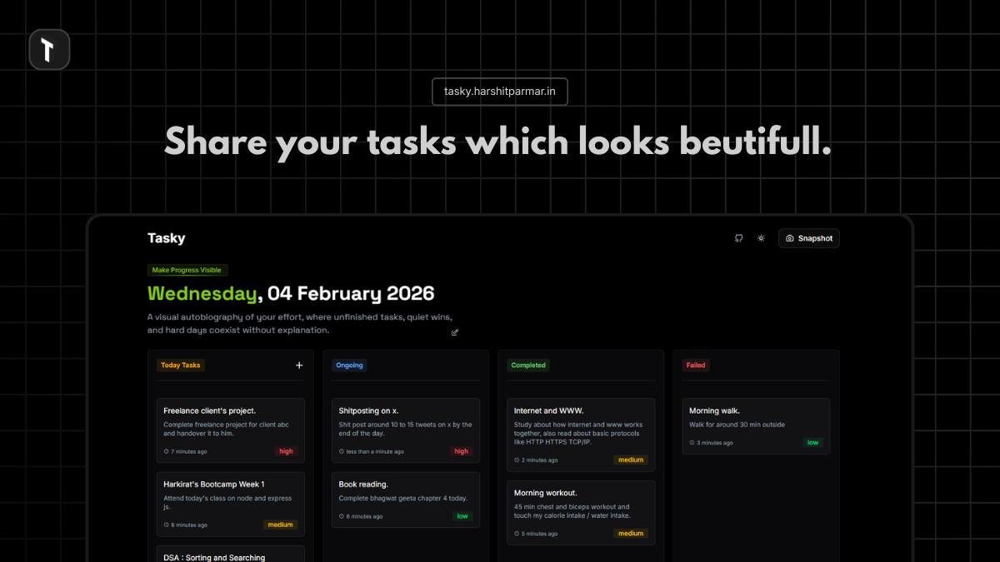

# Tasky ✨

<p align="center">
  
</p>

A modern, responsive, and beautiful Kanban board built with [Next.js](https://nextjs.org), [dnd-kit](https://dndkit.com/), and Tailwind CSS.  
Organize your tasks, boost productivity, and share your progress with stunning snapshot mode!

---

## Features

- **Drag & Drop:** Move tasks between columns with smooth, mobile-friendly drag-and-drop powered by dnd-kit.
- **Snapshot Mode:** Hide distractions and take a clean screenshot of your board to share on social media.
- **Task Priorities:** Set task priority (High, Medium, Low) and see it at a glance.
- **Auto-Reset:** Tasks reset automatically each day for fresh productivity.
- **Responsive Design:** Works beautifully on desktop and mobile.
- **Dark Mode:** Toggle between light and dark themes.
- **Social Sharing:** Share your board or app with built-in share buttons.
- **Gradient Accents:** Eye-catching gradient borders and accent colors for each column.

---

## Getting Started

### 1. Clone the repo

```bash
git clone https://github.com/yourusername/tasky-kanban-board.git
cd tasky-kanban-board
```

### 2. Install dependencies

```bash
npm install
```

### 3. Run the development server

```bash
npm run dev
```

Open [http://localhost:3000](http://localhost:3000) to view the app.

---

## Tech Stack

- **Next.js** – App Router, SEO, and performance
- **dnd-kit** – Drag-and-drop for desktop & mobile
- **Tailwind CSS** – Utility-first styling
- **Motion React** – Animations
- **Vercel Analytics** – Real-time analytics
- **date-fns** – Relative time formatting

---

## 🤝 Contributing

Pull requests and feedback are welcome!  
Please open an issue for bugs or feature requests.

---

## 💬 Contact

- [GitHub](https://github.com/harxhitbuilds/Tasky)
- [Twitter](https://x.com/harxhitbuilds)

---

> _Built with ❤️ by harxhitbuilds_
